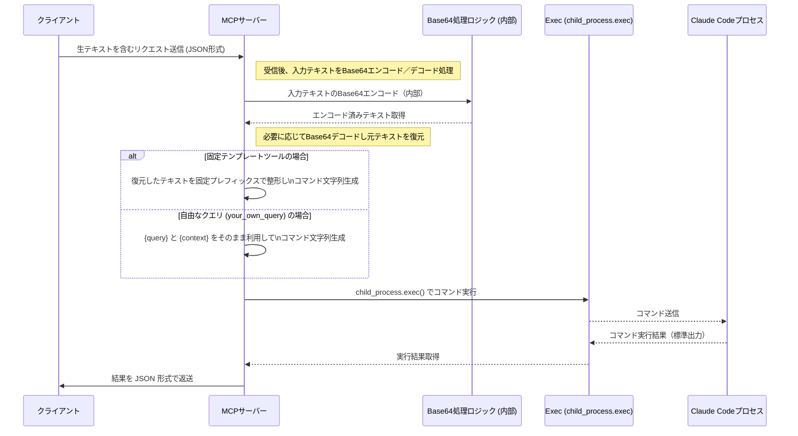

# claude-code-mcp Project

## Overview
このプロジェクトは、Claude Code MCP サーバーの構築と、それに付随するツール（explain_code、review_code、fix_code、edit_code、test_code、run_command、your_own_query）の実装を目的としています。サーバーは Node.js と MCP SDK を利用して実装され、Stdio 経由でクライアントからツールリクエストを受け取り、各ツール定義に基づいて `claude --print` コマンドを動的に生成・実行し、その結果をクライアントに返します。

今回、提案された入力処理の改善アプローチとして**Base64エンコード方式**が採択されました。これにより、クライアント側は生の自然言語テキスト（コードやREADMEなど）をそのまま送信でき、MCPサーバー内部で特殊文字（改行、ダブルクオートなど）の問題をBase64エンコード／デコードにより確実に解決します。これがシステム全体の安定性と柔軟性を向上させるキーとなります。

サーバーの主な役割は以下となります：
- **リクエスト受信:** クライアントから JSON 形式のツールリクエストを受け取る（例: `code`, `context`, `focus_areas` など）。
- **入力処理:** 受信した自然言語テキストを内部でBase64エンコード／デコード処理し、エスケープ問題を解決する。
- **ツール選別とコマンド生成:** リクエストのツール名に応じて、固定テンプレートまたは自由形式（your_own_query）を用い、問い合わせ用のコマンド文字列を組み立てる。
- **コマンド実行:** Node.js の child_process.exec を利用して、組み立てたコマンドを実行し、標準出力から結果を取得する。
- **結果返送:** 実行結果を JSON 形式でクライアントに返す。

## 動作シーケンスの概要 (Sequence Diagram)
以下のシーケンス図は、各コンポーネントごとに分担された処理内容を示しています。



## MCP Server Input Handling Strategy
本セクションでは、現状の入力処理の状態と、提案されたアプローチの詳細、及び各案の比較マトリックスについて説明します。

### 現状の状態
- **入力形式:**  
  各ツールは、JSON形式のパラメータ（例: `code`、`context`、`focus_areas` など）を受け取り、内部で固定のテンプレート（例:  
  `claude --print "Review the following code and focus on: {focus_areas}\n{code}"`）を用いて Claude Code へ問い合わせています。
- **問題点:**  
  - 自然言語の非構造的データは改行やダブルクオートなど、特殊文字が多く含まれるため、直接JSON内に挿入するとエスケープ処理が非常に複雑になる。  
  - 固定のテンプレートに依存すると、入力の自由度が低下し、ニュアンスが失われる可能性がある。

### 採用されたアプローチ
**Base64エンコード方式**を採択し、以下の方針をMCPサーバー内部に実装します：
- **目的:**  
  エスケープ処理の複雑性を低減し、どんなテキストでも安全にClaude Codeへ渡せるようにする。
- **実施方法:**  
  クライアントは生の自然言語テキストを送信し、MCPサーバー内部で自動的にBase64エンコード／デコード処理を実施して、最終的な問い合わせコマンドを生成する。
- **メリット:**  
  - クライアント側はシンプルなデータ送信で済み、特殊文字のエスケープについて心配不要。  
  - 全体としてシステムの安定性、柔軟性、メンテナンス性が向上する。

### 提案される各アプローチの比較マトリックス
| アプローチ                 | 実装の複雑さ | 柔軟性 | 特殊文字耐性 | コード・非コードテキスト向き |
|----------------------------|--------------|--------|--------------|----------------------------|
| 固定テンプレートクエリ方式 | 低           | 低     | 高           | 中程度                     |
| 自由な自然言語クエリ方式   | 中           | 高     | 低 (エスケープ問題) | 高                        |
| Base64エンコード方式       | 中           | 高     | 非常に高い   | 非常に高い                 |
| ファイル参照方式           | 低           | 中     | 非常に高い   | 中程度                     |

### 決定方針
上記の比較から、**Base64エンコード方式**を採用し、**エンコード／デコード処理はMCPサーバー内部で実施**することに決定しました。これにより、クライアントは生テキストを送信でき、サーバーで特殊文字問題を一括して処理、Claude Codeへの問い合わせ内容が正確に伝達されます。

## MCP Host Configuration Example
以下は、MCP Host に設定するための設定例です：

```json
{
  "mcpServers": {
    "claude-code-server": {
      "command": "node",
      "args": ["/home/kunihiros/dev/aider/projects/claude-code-mcp/claude-code-server/build/index.js"],
      "env": {},
      "disabled": false,
      "autoApprove": []
    }
  }
}
``>
